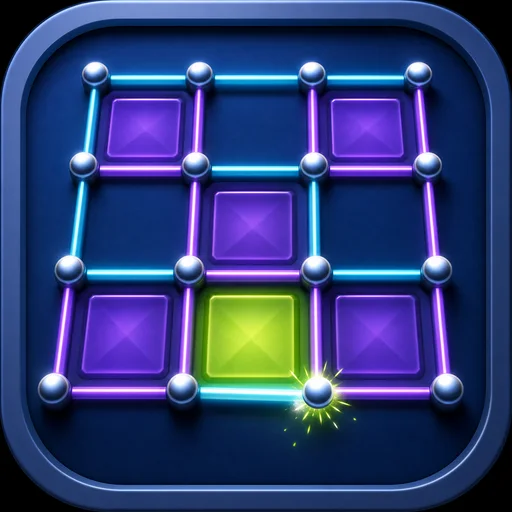
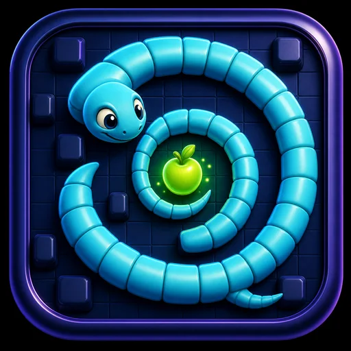
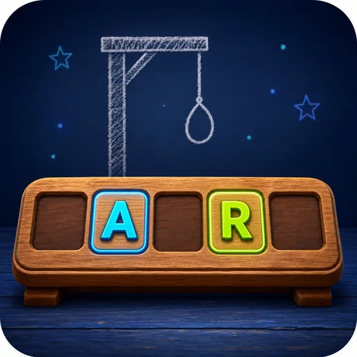
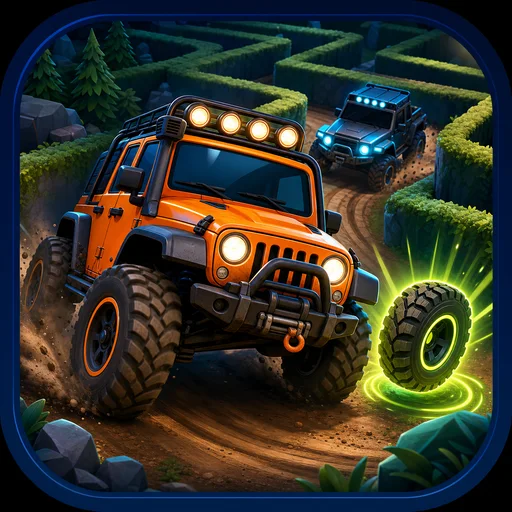
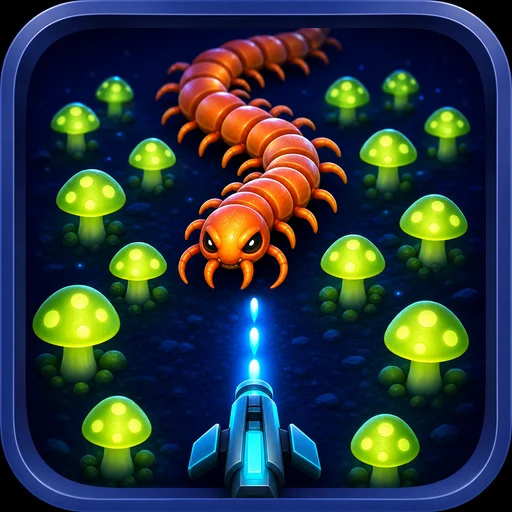
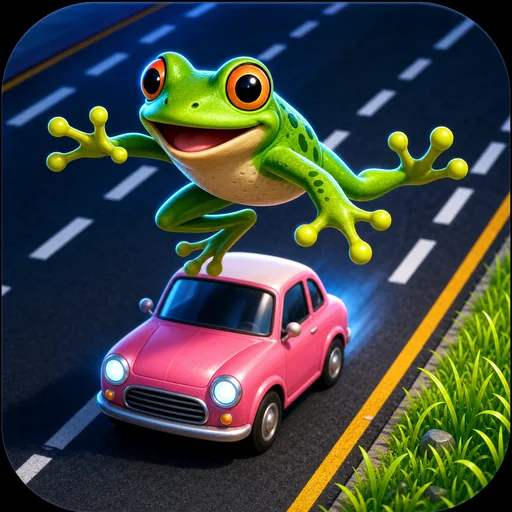

# Daemoncade game catalog

Every game is versioned independently. Its icon, metadata, and playable files travel together in its directory.

This page is generated from the per-game `game.json` files by `./scripts/build-catalog.py`.

## Stable

| Icon | Game | Version | About |
| --- | --- | --- | --- |
|  | [Maze Defense](maze-defense/) | `1.0.0` | Build the maze as you defend it. Place and upgrade towers, reshape enemy routes, and survive increasingly devious waves. |

## Beta

| Icon | Game | Version | About |
| --- | --- | --- | --- |
|  | [Mines](mines/) | `1.0.0-beta.1` | Clear the field, mark the mines, and try to beat your best time at every difficulty. |
|  | [Sinkhole City](sinkhole-city/) | `1.0.0-beta.1` | Start as a pothole, swallow everything small enough to fit, and grow into a world-eating sinkhole before time runs out. |
|  | [Blockfall](blockfall/) | `1.0.0-beta.1` | Stack falling pieces in endless or timed play and chase a high score saved on this device. |
|  | [Chess](chess/) | `1.0.0-beta.1` | Play a complete chess game against a local computer opponent or someone sharing the board. |
|  | [Checkers](checkers/) | `1.0.0-beta.1` | Play classic checkers against the computer or share the board with someone beside you. |
|  | [Dots and Boxes](dots-and-boxes/) | `1.0.0-beta.1` | Draw one line at a time, close boxes, and hold the turn long enough to own the board. |
|  | [Space Rocks!](space-rocks/) | `1.0.0-beta.1` | Pilot a vector ship through splitting asteroids, UFOs, hyperspace jumps, and escalating waves. |

## Alpha

| Icon | Game | Version | About |
| --- | --- | --- | --- |
|  | [Canyon Crawler](canyon-crawler/) | `0.1.0-alpha.1` | Defend your rover from segmented trail worms and the hazards filling the canyon wash. |
|  | [Orbit Run](orbit-run/) | `0.1.0-alpha.1` | Circle the tunnel, fire inward, and survive enemies spiraling out from its center. |
|  | [Connect Four](connect-four/) | `0.1.0-alpha.1` | Build a line of four against the computer or someone sharing your screen. |
|  | [Tic-Tac-Toe](tic-tac-toe/) | `0.1.0-alpha.1` | Settle a quick round against three levels of computer play or a local opponent. |
|  | [Snake](snake/) | `0.1.0-alpha.1` | Eat, grow, accelerate, and avoid becoming your own biggest obstacle. |
|  | [Hangman](hangman/) | `0.1.0-alpha.1` | Solve a random phrase or let someone nearby enter a secret one for you. |
|  | [Paddle Duel](paddle-duel/) | `0.1.0-alpha.1` | Practice against the wall, challenge the computer, or share the keyboard for a local paddle match. |
|  | [Pinball](pinball/) | `0.1.0-alpha.1` | Launch into a neon physics table with bumpers, slingshots, ball saves, and multiball. |
|  | [Casey](casey/) | `0.1.0-alpha.1` | Guide an off-road hero through multiple maze routes, power tires, rivals, and roadside bonuses. |
|  | [Missiles Away](missiles-away/) | `0.1.0-alpha.1` | Defend cities and missile silos through escalating barrages, bombers, smart weapons, and MIRVs. |
|  | [Chilopodophobia](chilopodophobia/) | `0.1.0-alpha.1` | Blast a splitting centipede through mushrooms while spiders, fleas, and scorpions invade the field. |
|  | [Road Hopper](road-hopper/) | `0.1.0-alpha.1` | Cross increasingly busy lanes, reach safety, and keep your remaining lives intact. |
|  | [Jungle Jumper](jungle-jumper/) | `0.1.0-alpha.1` | Run a long jungle route filled with pits, vines, crocodiles, rolling logs, snakes, and treasure. |
