# Daemoncade game catalog

Every game is versioned independently. Its icon, metadata, and playable files travel together in its directory.

This page is generated from the per-game `game.json` files by `./scripts/build-catalog.py`.

## Stable

| Icon | Game | Version | Mobile | About |
| --- | --- | --- | --- | --- |
|  | [Circuit Rush](../games/circuit-rush/) | `1.2.0` | Yes | Read the entire circuit, master momentum and sliding grip, collect wrenches, and outdrive three rivals across compact arcade championships. |
| 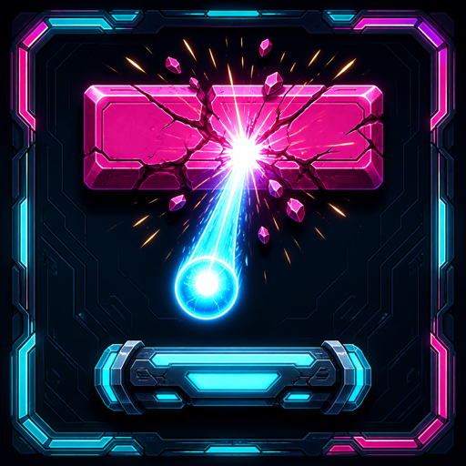 | [Neon Breaker](../games/neon-breaker/) | `1.1.1` | Yes | Break luminous formations, chain combos, and bend each run with modern power-ups in a kinetic brick-breaking tribute. |
| 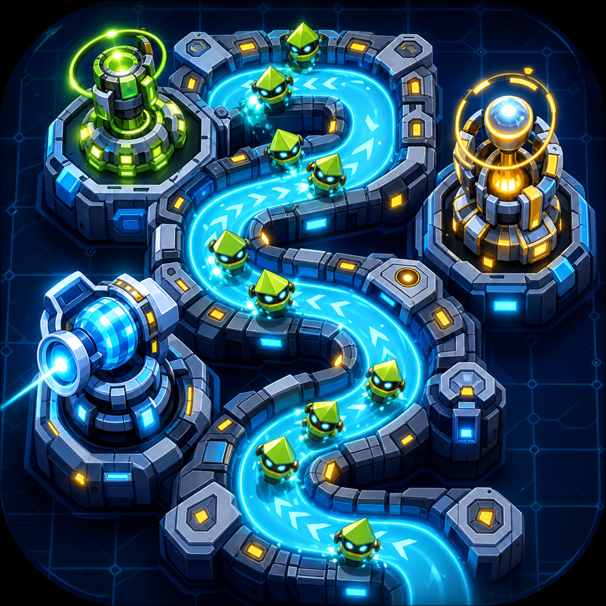 | [Maze Defense](../games/maze-defense/) | `1.0.0` | Yes | Build the maze as you defend it. Place and upgrade towers, reshape enemy routes, and survive increasingly devious waves. |
| 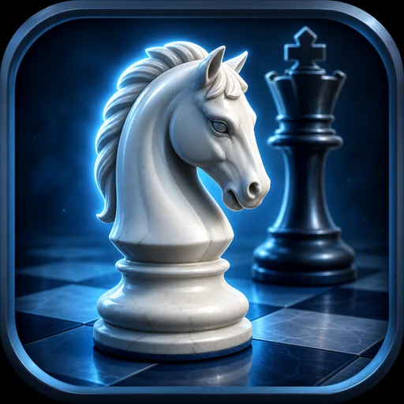 | [Chess](../games/chess/) | `1.0.0` | Yes | Play a complete chess game against a local computer opponent or someone sharing the board. |
|  | [Checkers](../games/checkers/) | `1.0.0` | Yes | Play classic checkers against the computer or share the board with someone beside you. |
|  | [Connect Four](../games/connect-four/) | `1.0.0` | Yes | Build a line of four against the computer or someone sharing your screen. |
|  | [Tic-Tac-Toe](../games/tic-tac-toe/) | `1.0.0` | Yes | Settle a quick round against three levels of computer play or a local opponent. |
| 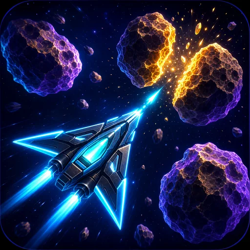 | [Space Rocks!](../games/space-rocks/) | `1.0.0` | — | Pilot a vector ship through splitting asteroids, UFOs, hyperspace jumps, and escalating waves. |

## Beta

| Icon | Game | Version | Mobile | About |
| --- | --- | --- | --- | --- |
|  | [Racecar](../games/racecar/) | `1.0.0-beta.1` | — | Battle traffic or race CPU rivals across six segment-projected night routes with authored curves, drafting, pickups, and changing road conditions. |
| 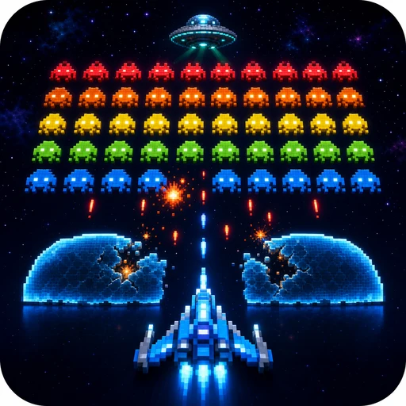 | [Space Defender](../games/space-defender/) | `1.0.0-beta.2` | — | Hold the line against marching alien formations, protect your shields, and survive escalating attack waves. |
|  | [Mines](../games/mines/) | `1.0.0-beta.1` | Yes | Clear the field, mark the mines, and try to beat your best time at every difficulty. |
| 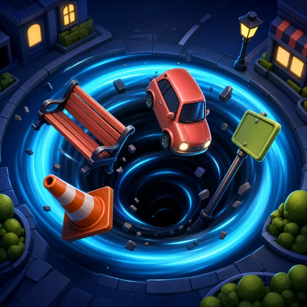 | [Sinkhole City](../games/sinkhole-city/) | `1.0.0-beta.1` | Yes | Start as a pothole, swallow everything small enough to fit, and grow into a world-eating sinkhole before time runs out. |
| 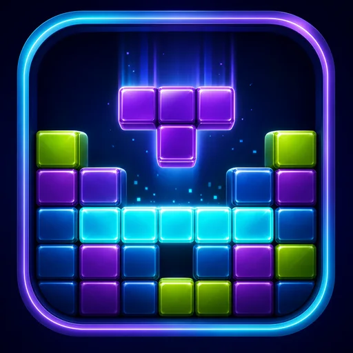 | [Blockfall](../games/blockfall/) | `1.0.0-beta.1` | Yes | Stack falling pieces in endless or timed play and chase a high score saved on this device. |
|  | [Dots and Boxes](../games/dots-and-boxes/) | `1.0.0-beta.1` | Yes | Draw one line at a time, close boxes, and hold the turn long enough to own the board. |

## Alpha

| Icon | Game | Version | Mobile | About |
| --- | --- | --- | --- | --- |
| 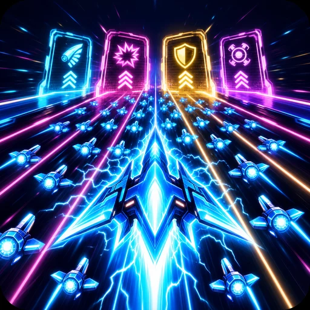 | [Blitz!](../games/blitz/) | `0.1.0-alpha.1` | — | Lead a growing combat swarm through a four-lane neon rush of gates, enemies, bosses, and persistent upgrades. |
| 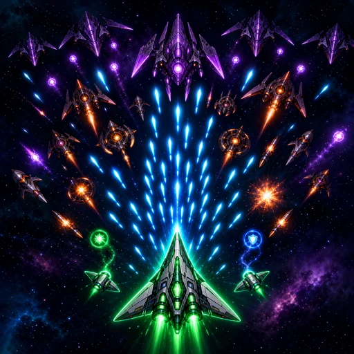 | [Spacefighter](../games/spacefighter/) | `0.1.0-alpha.1` | — | Thread a nimble fighter through dense enemy patterns, collect weapon upgrades, and unleash missiles and bombs. |
| 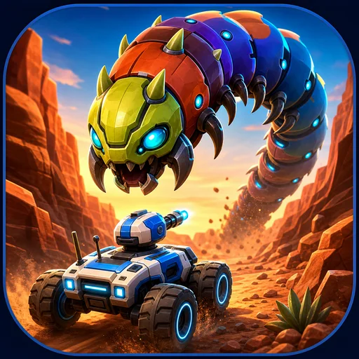 | [Canyon Crawler](../games/canyon-crawler/) | `0.1.0-alpha.1` | — | Defend your rover from segmented trail worms and the hazards filling the canyon wash. |
| 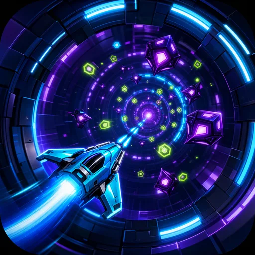 | [Orbit Run](../games/orbit-run/) | `0.1.0-alpha.1` | — | Circle the tunnel, fire inward, and survive enemies spiraling out from its center. |
|  | [Snake](../games/snake/) | `0.1.0-alpha.1` | Yes | Eat, grow, accelerate, and avoid becoming your own biggest obstacle. |
|  | [Hangman](../games/hangman/) | `0.1.0-alpha.1` | Yes | Solve a random phrase or let someone nearby enter a secret one for you. |
| 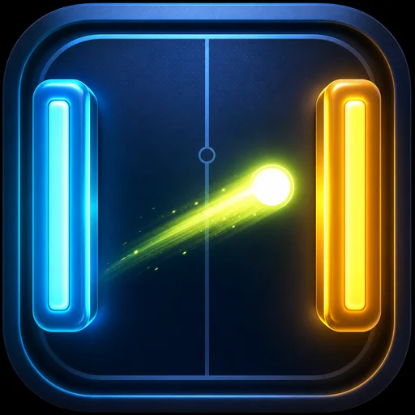 | [Paddle Duel](../games/paddle-duel/) | `0.1.0-alpha.1` | — | Practice against the wall, challenge the computer, or share the keyboard for a local paddle match. |
|  | [Pinball](../games/pinball/) | `0.1.0-alpha.1` | — | Launch into a neon physics table with bumpers, slingshots, ball saves, and multiball. |
|  | [Casey](../games/casey/) | `0.1.0-alpha.1` | — | Guide an off-road hero through multiple maze routes, power tires, rivals, and roadside bonuses. |
|  | [Missiles Away](../games/missiles-away/) | `0.1.0-alpha.1` | — | Defend cities and missile silos through escalating barrages, bombers, smart weapons, and MIRVs. |
|  | [Chilopodophobia](../games/chilopodophobia/) | `0.1.0-alpha.1` | — | Blast a splitting centipede through mushrooms while spiders, fleas, and scorpions invade the field. |
|  | [Road Hopper](../games/road-hopper/) | `0.1.0-alpha.1` | — | Cross increasingly busy lanes, reach safety, and keep your remaining lives intact. |
| 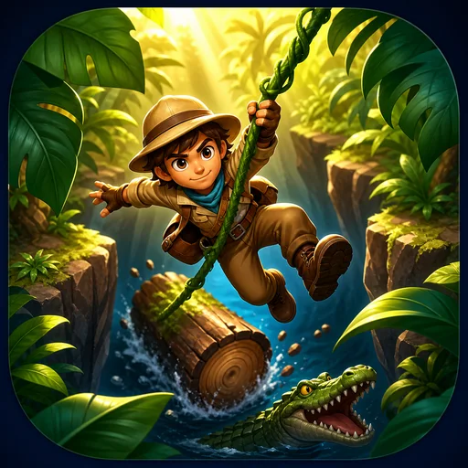 | [Jungle Jumper](../games/jungle-jumper/) | `0.1.0-alpha.1` | — | Run a long jungle route filled with pits, vines, crocodiles, rolling logs, snakes, and treasure. |
